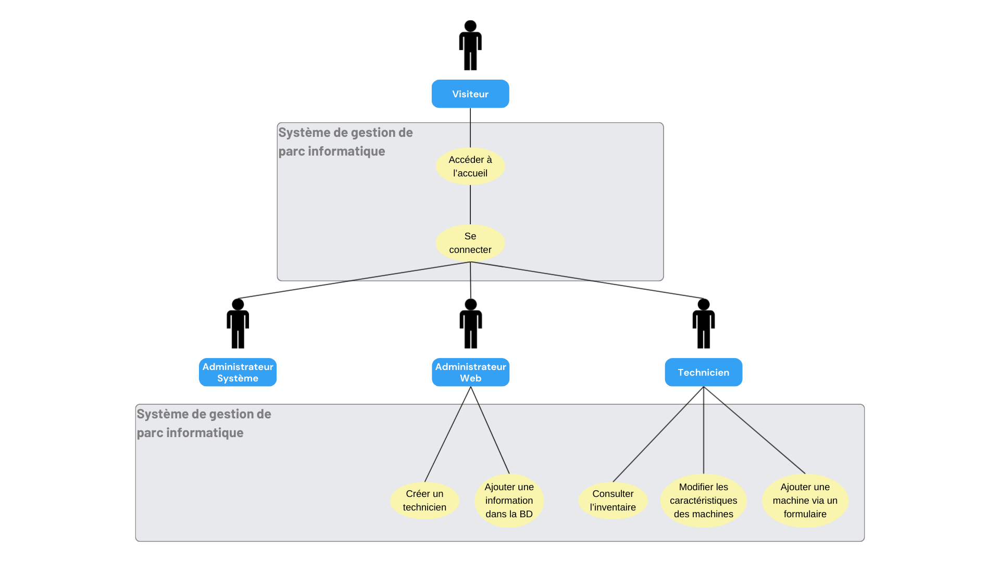
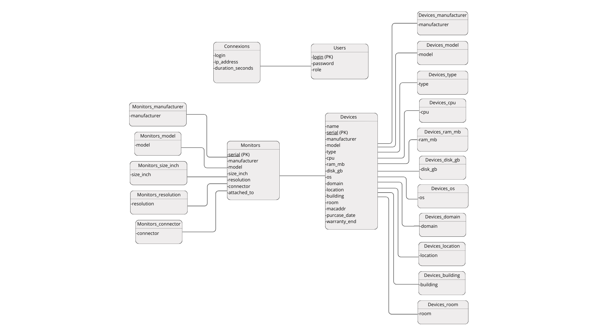

AYMARD Thomas								**INFI2-A**  
CROCHET Thomas  
MESSAGER Romain  
MIQUEL Adrien  
PERES Thomas

**Documentation** Plateforme de gestion de parc informatique

### 

### Rappel : Méthode de connexion : {#rappel-:-méthode-de-connexion-:}

- Accéder au site [http://rpi10/](http://rpi10/)  
- Appuyer sur le bouton login  
- Entrer les informations correspondant à votre compte

**Administrateur web**

Ajout des fonctionnalités : 

- Un administrateur possédant le rôle *“administrateur\_web”* dans la base de données peut maintenant ajouter un technicien à partir de son interface une fois connecté.  
- Un administrateur possédant le rôle *“administrateur\_web”* dans la base de données peut également ajouter une information consultable par les technicien (dans l’inventaire).  
- Ainsi, dans l’interface *“Admin web”* , deux boutons ont été ajoutés : *“Ajouter techniciens”* et *“Ajouter information”*.

Pour ce faire : 

- Connectez vous en admin web avec le [rappel de connexion](#rappel-:-méthode-de-connexion-:) (id : adminweb pwd : adminweb)  
- Une fois connecté, cliquez sur le bouton “Admin web” en haut au centre de votre écran.  
- Vous accéderez ensuite à une interface composée de plusieurs boutons ajoutés à gauche de l’écran (*“Ajouter un technicien”* et  *“Ajouter un constructeur”*)  
- Cliquez ensuite sur “*Ajouter un technicien”* et renseignez les informations nécessaires (Login \+ Mot de passe).  
- Cliquez sur “Créer le technicien” ou “Ajoutez une information” selon vos envies.

**Technicien**

Ajout des fonctionnalités :

- Consultation de l’inventaire en détail.  
- Modification des détails des éléments dans l’inventaire  
- Ajout d’une machine.

Utilisation :

Pour accéder à vos fonctions appuyer sur le bouton “Inventaire” au milieu de l’entête.  
Vous pourrez observer l'ensemble de votre inventaire ainsi que l’Inventaire de Rebus.   
Toute les prochaines instructions se basent sur cette page.

- Pour obtenir plus d'informations sur la machine actuelle, cliquez sur “consulter”.   
- Pour modifier les informations de la machine actuelle, cliquez sur le “modifier” de la machine correspondante.   
  Vous pourrez rentrer dans les champs les informations à changer puis appuyer sur le bouton “enregistrer”.  
- Pour ajouter une machine, appuyez sur le bouton “ajouter une machine” en haut de la page à droite.   
  Complétez les champs et appuyez sur le bouton “ajouter”. 

Diagramme des cas d’utilisation (UML)  
\- VERSION DE L'ÉCHÉANCE 2

NB : Ce diagramme représente seulement les fonctionnalités implémentées sur le site web à dater du 05/12/2025.

Modèle logique des données de la BD  
\- VERSION DE L'ÉCHÉANCE 2

NB : Ce MLD fait figurer les tables de la base données exactement comme elles sont définies dans la base de données physique, à dater du 05/12/2025. Bien que les clés étrangères n'aient pas encore été réellement définies dans la base de données, les relations entres les tables sont plus ou moins représentées par les associations entre tables du schéma ci-dessous.

*PK : Primary Key*

Commentaire : Nous avons décidé de créer de multiples tables contenant les informations qu’on considère valides pour les différents champs des tables Monitors et Devices. Ainsi, on peut restreindre la valeur qu’on attribue à un champ en forçant l’utilisateur à choisir parmi les valeurs contenues dans des tables telles que Devices\_os ou Devices\_room lors de la création d’une machine, par exemple. Aussi, il devient facile pour un administrateur de “créer une information qui peut être réutilisée par les techniciens”, ce qui équivaut à une simple insertion dans la table concernée.
